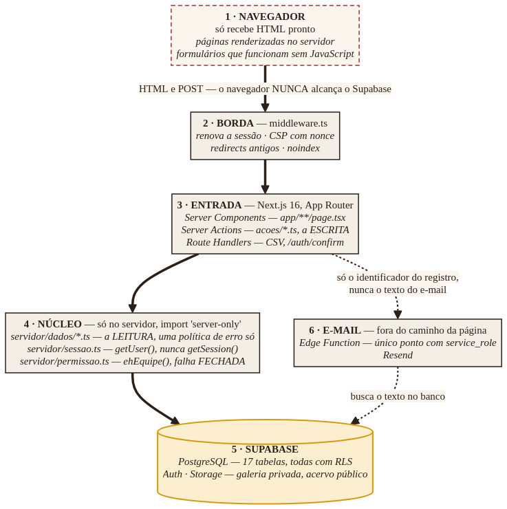
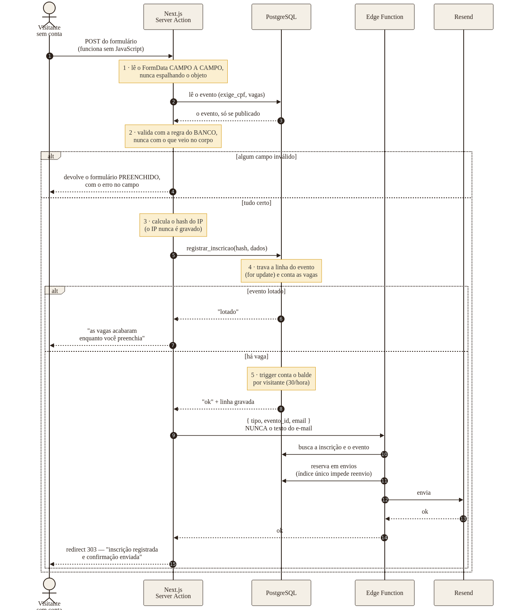
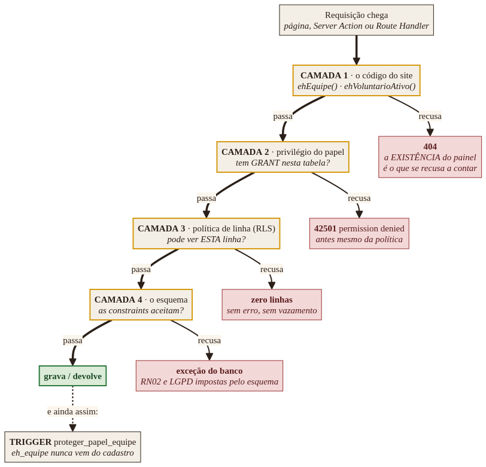
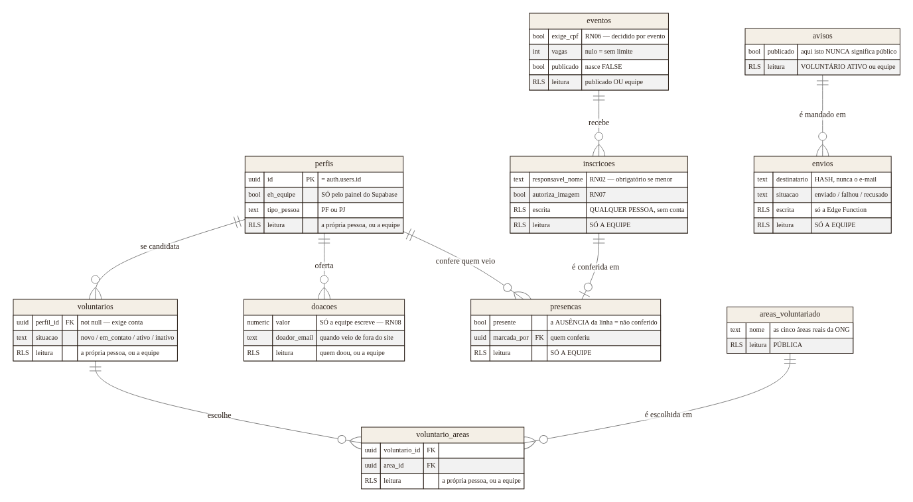

# Arquitetura — Ateliê Afro Cultural

**Fatec Innovation Challenge · Venturus** · 4 de setembro de 2026
Produção: <https://www.atelieafrocultural.site>

---

## Em uma frase

Um site renderizado no servidor, onde **o navegador nunca fala com o banco**, e onde a
autorização de verdade mora no PostgreSQL — não no código.

Tudo o que vem a seguir é consequência dessas duas escolhas.

---

## Stack

| Camada | O quê | Por quê |
|---|---|---|
| Aplicação | **Next.js 16** (App Router), React 19, TypeScript | Renderização no servidor: o HTML chega pronto, e o site funciona **sem JavaScript** |
| Estilo | **CSS próprio**, quatro arquivos | Nenhum framework de CSS, nenhuma biblioteca de componentes — restrição do projeto |
| Dados | **Supabase** (PostgreSQL + Auth + Storage) | Row Level Security nativa: a política de acesso vive na mesma transação do dado |
| E-mail | **Resend**, por uma Edge Function | Único ponto do sistema com a chave de serviço |
| Hospedagem | **Vercel** (Netlify como reserva) | Camada gratuita — a ONG declara dificuldade de sustentabilidade financeira |

**Nenhuma dependência paga.** O custo de operação é o domínio: cerca de R$ 40 por ano.

> **Divergência declarada em relação ao Anexo III do Regulamento Técnico.** A stack obrigatória
> pede Express, Vite, MySQL e Sequelize. Este projeto atende os dois pilares que a ficha de
> avaliação nomeia — o ambiente de execução é **Node.js** e a interface é **React** — e diverge
> nos demais. A razão é uma só: **o público da ONG começa aos 10 anos**, e as políticas de
> acesso do PostgreSQL põem a autorização na mesma transação do dado, onde o esquecimento vira
> resultado *vazio* e não vazamento silencioso. O argumento completo, com o que a decisão
> custou, está na **seção 5 do Documento de Requisitos**.

---

## 1. As camadas

*Fonte: [`diagramas/01-camadas.mmd`](diagramas/01-camadas.mmd) · também em [SVG](renderizado/01-camadas.svg)*

A linha tracejada à esquerda é a mais importante do diagrama: **ela não existe.** O navegador
não tem caminho até o Supabase, e isso é garantido por três mecanismos independentes:

1. **`import 'server-only'`** no topo de todo módulo de dados — quem tentar importá-lo num
   componente de cliente recebe erro de *build*, não um defeito em produção;
2. **as variáveis de ambiente não têm o prefixo `NEXT_PUBLIC_`**, então o empacotador não as
   embute no JavaScript que o navegador baixa;
3. **a política de conteúdo (CSP)** não lista o Supabase em `connect-src`. Ele aparece em
   `img-src`, e a diferença é exata: `img-src` autoriza *baixar imagem*; quem governa
   `fetch`, `XHR` e `WebSocket` é o `connect-src`.

### A separação entre ler e escrever

- **`servidor/dados/*.ts`** — só leitura, chamada pelas páginas.
- **`acoes/*.ts`** — só escrita, chamada pelos formulários.

A separação não é organização: **Server Action é um endpoint HTTP público.** Qualquer pessoa a
chama, com qualquer corpo, sem passar pelo formulário. Por isso toda validação roda lá dentro,
e o `FormData` é lido **campo a campo por nome** — nunca espalhado num objeto, que é como uma
coluna de privilégio voltaria a entrar pela porta da frente.

---

## 2. Uma inscrição, ponta a ponta

*Fonte: [`diagramas/02-inscricao.mmd`](diagramas/02-inscricao.mmd) · também em [SVG](renderizado/02-inscricao.svg)*

Escolhido por atravessar **todas** as camadas e todas as travas: entrada pública sem conta,
validação, limite por visitante, concorrência por vaga e e-mail.

Três decisões que o diagrama mostra e que não são óbvias:

**A regra vem do banco, não do formulário.** Se o CPF é obrigatório naquele evento é a coluna
`exige_cpf` que decide. Viesse do corpo da requisição, quem quisesse pular o campo mandaria
`false`.

**A vaga é conferida com a linha do evento travada.** Conferir no servidor não resolveria:
duas pessoas enviando ao mesmo tempo o formulário do último lugar veriam, as duas, uma vaga
livre. O `for update` faz a segunda esperar a primeira terminar antes de contar.

**O e-mail nunca derruba a inscrição.** Ela já está gravada quando o e-mail é pedido. Se o
envio falhar, a pessoa lê *"inscrição registrada, e a confirmação não saiu desta vez"* — e
não *"não deu para inscrever"*, que a faria se inscrever de novo e ocupar outra vaga.

---

## 3. Segurança em camadas

*Fonte: [`diagramas/03-seguranca.mmd`](diagramas/03-seguranca.mmd) · também em [SVG](renderizado/03-seguranca.svg)*

**A guarda do código nunca é a tranca.** Ela decide o que *desenhar*; quem decide o que *pode*
é o banco — e ele recusa em dois pontos antes de a política sequer ser consultada.

Medido contra o banco de produção: um `select` anônimo em `contatos`, `inscricoes`,
`voluntarios`, `doacoes` ou `avisos` responde **`42501 permission denied`** — o papel anônimo
não recebeu `GRANT`, então não tem nem o privilégio de tentar.

**E essa ordem nos custou um dia, o que é a melhor prova de que ela é real.** Em 03/09/2026 o
e-mail de confirmação de inscrição não saía, e a função respondia "registro não encontrado"
para um registro que existia. A causa não era o código: era que o papel `service_role` — o
papel privilegiado, que *ignora a RLS* — nunca havia recebido `GRANT` nas tabelas, porque toda
migration deste projeto concede privilégio nominalmente a `anon` e `authenticated`. Ignorar a
política não é ignorar o privilégio. A correção é a `013_service_role.sql`, e ela concede
exatamente as sete tabelas que a função consulta, com escrita em uma só.

### Duas assimetrias deliberadas

| | |
|---|---|
| **O painel recusa com 404, a área do usuário com redirect** | A *existência* do painel é o que se recusa a contar. Que o site tem contas está escrito em toda página — quem chega sem sessão em `/minha-conta` precisa da tela de entrar, não de um 404 que esconderia dela o caminho da própria conta |
| **O conteúdo público degrada, o painel falha fechado** | Banco fora do ar: a página pública continua no ar com o estado vazio escrito. O painel responde 404. Conteúdo existe para ser lido; permissão, na dúvida, se nega |

### O que nunca entra no repositório

A **chave de serviço** do banco. Ela existe apenas como *secret* da Edge Function, e é por
isso que a função existe: uma chave capaz de ignorar toda a segurança do banco não pode viver
no mesmo lugar que o resto do código.

Consequência aceita: **este repositório não consegue aplicar migration.** Quem aplica é uma
pessoa, no editor SQL. Onde isso importa, o código degrada e **avisa** — a página de inscrição
continua gravando sem a função nova, e grita no log o nome do arquivo a aplicar.

---

## 4. Modelo de dados

*Fonte: [`diagramas/04-dados.mmd`](diagramas/04-dados.mmd) · também em [SVG](renderizado/04-dados.svg)*

São **17 tabelas, todas com RLS**. O diagrama mostra as 10 que se relacionam; as outras sete
não têm chave estrangeira e estão aqui:

| Tabela | Quem lê | Observação |
|---|---|---|
| `atividades` | **pública** | As 11 atividades reais da ONG. `id` é apelido, não uuid |
| `publicacoes` | publicado **ou** equipe | Notícias. `publicado` nasce `false` |
| `midia` | publicado **e** autorizado, ou equipe | Galeria. A autorização de imagem (RN07) é coluna |
| `acervo` | **pública** | Download livre é requisito |
| `clipping` | **pública** | Os 14 registros de imprensa |
| `contatos` | **só a equipe** | Escrita aberta a qualquer pessoa, leitura negada |
| `envios_recentes` | só a equipe | Limite de envio. Guarda o **hash** do IP — o IP nunca é gravado |

### Três decisões do esquema que carregam regra de negócio

**`avisos` é tabela nova, não uma coluna em `publicacoes`.** A política daquela tabela é
`publicado or eh_equipe()`, e um anônimo lê tudo que está publicado. Reaproveitá-la faria a
segurança da comunicação **interna** depender de um `and not interno` escrito certo em toda
consulta, para sempre. Um esquecimento publicaria na internet aberta um aviso escrito para
dentro — e ninguém veria.

**A ausência de linha em `presencas` é um terceiro estado.** Veio, não veio, e *ninguém
conferiu*. Numa prestação de contas os dois últimos são coisas muito diferentes, e um sistema
que só soubesse "marcado / não marcado" transformaria uma lista não conferida numa lista de
faltas.

**`inscricoes` não tem coluna de perfil, de propósito.** Inscrever-se não exige conta —
reduzir atrito importa mais que histórico individual. É a decisão que separa esta tabela de
`voluntarios`, cuja `perfil_id` é `not null`.

---

## 5. Como isto é verificado

| Camada | Quantidade | O que ela mede |
|---|---|---|
| Testes offline | **1268** | Determinísticos, sem rede. Incluem varreduras que cobram a **presença e a ausência** de guardas |
| Testes com o banco real | **1269** | Impede o site de servir conteúdo versionado achando que lê o banco |
| Testes contra PostgreSQL real | **118** | As políticas de acesso, com as migrations reais aplicadas |
| Navegador | Firefox | Com e sem JavaScript, a 375px e 1280px |

Um exemplo do que as varreduras pegam: há um teste que **falha se a Action pública de
inscrição ganhar uma guarda de equipe**, e um teste irmão que falha se a Action do painel
perder a dela. As duas exigências são opostas, e as duas estão escritas — porque quem ler as
quatro Actions do painel vai achar que faltou a guarda na pública.

---

## 6. O que a arquitetura recusou

| Recusado | Por quê |
|---|---|
| Biblioteca de geração de PDF | O navegador já imprime. No Android, "imprimir" abre *Salvar como PDF* — e o documento sai igual **sem JavaScript**, porque quem o gera é o CSS |
| Framework de CSS e biblioteca de componentes | Peso no plano de dados de quem opera do celular, e uma dependência a manter |
| Chave de serviço no repositório | Uma chave que ignora toda a segurança do banco não pode viver junto do resto |
| Gateway de pagamento | A ONG pediu *"registro de doações recebidas"*, não meio de pagamento (RN08) |
| Chat em tempo real | O formulário da ONG marcou "Comunicação interna" com um ponto de interrogação. As ferramentas atuais deles são WhatsApp e e-mail |
